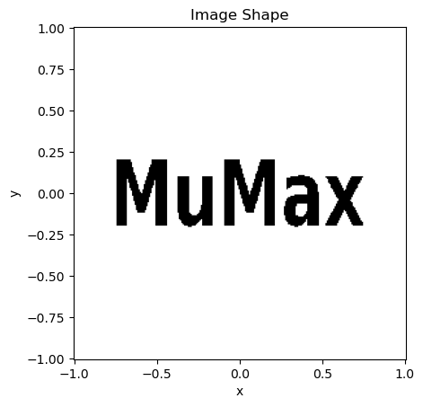
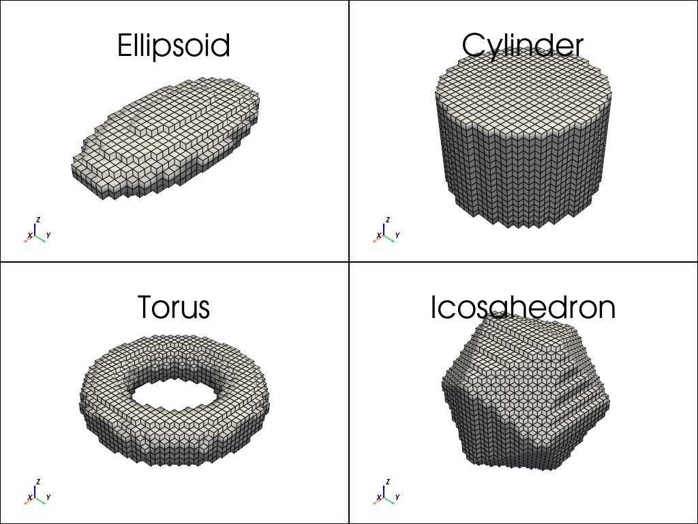
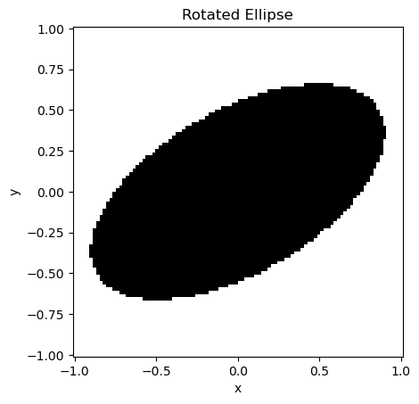
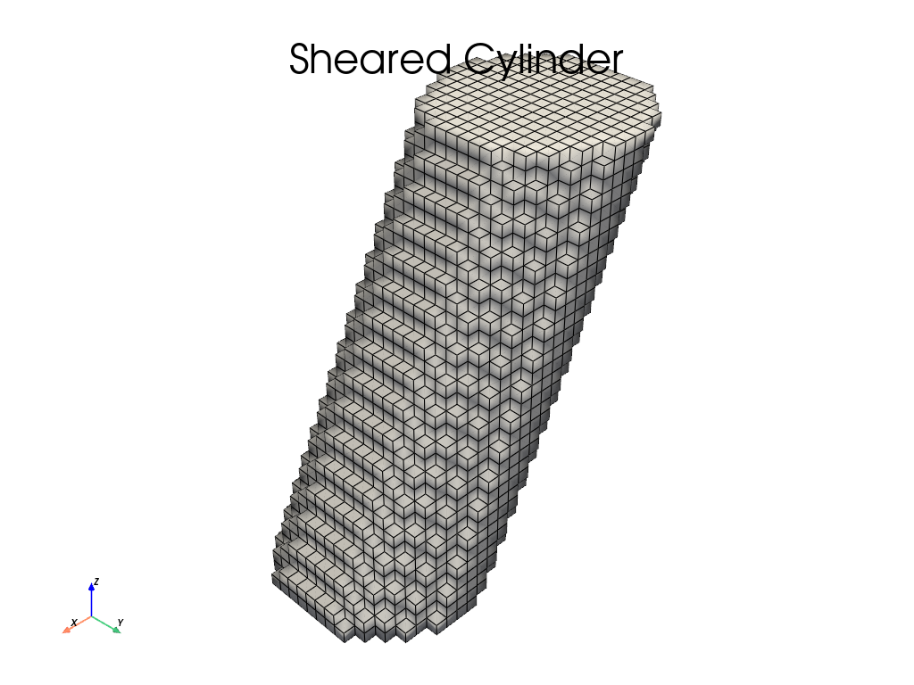
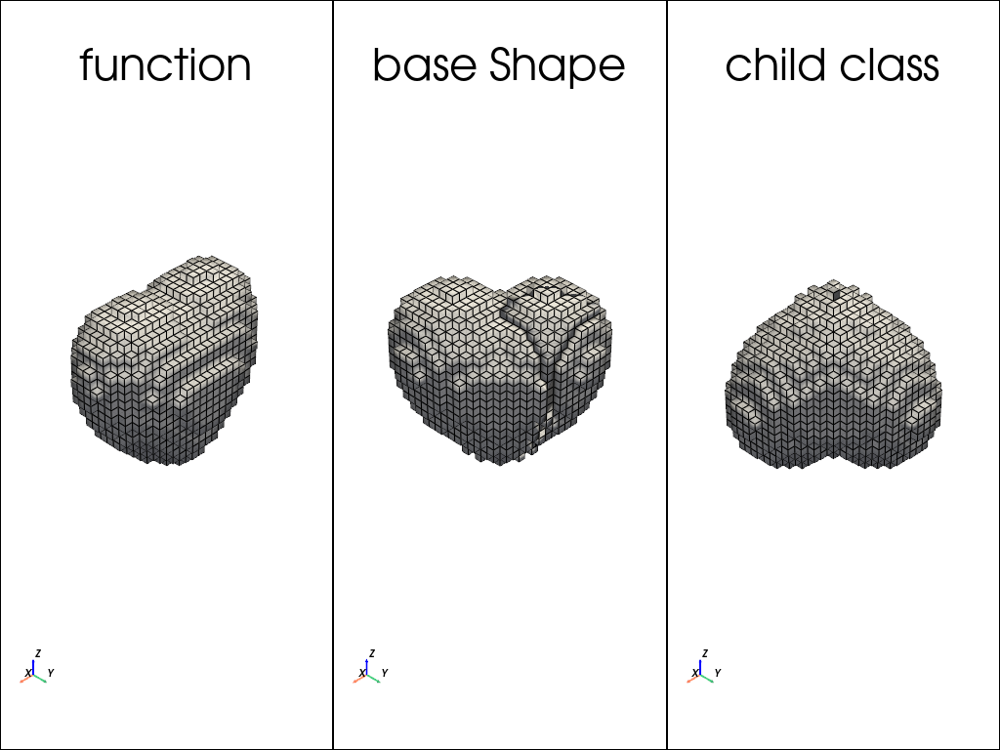
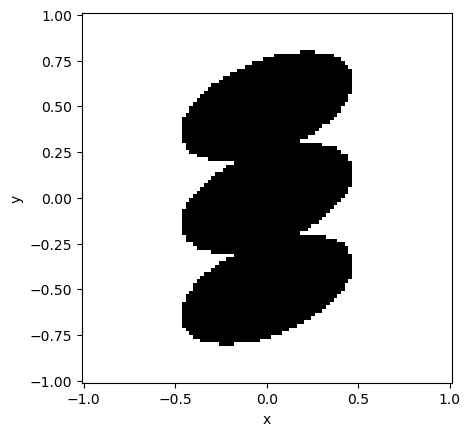

Shapes
======

Imports
-------

.. code-block:: python

    import mumaxplus.util.shape as shapes
    import numpy as np
    import matplotlib.pyplot as plt
    import pyvista as pv

What are Shapes?
----------------

In mumax⁺ you can use the util package to define shapes. Each shape is a mutable
instance of the Shape class, which holds and manipulates a function. This shape
function takes an (x, y, z) coordinate (in meters) and returns True if it lies
within the shape. All methods called upon a shape will manipulate it. They can
transform, translate or rotate the shape, or can combine it with other shapes
using boolean operations. There are quite a few built-in shapes.

For example, here ``my_shape`` is defined to be a basic ``Circle`` with a diameter
of 2 (meters). To check if ``(0, 0, 0)`` or ``(1, 1, 0)`` lie within it, ``my_shape``
can be evaluated directly like a function.

.. code-block:: python

    my_shape = shapes.Circle(2)
    print("Is (0,0,0) within my_shape?", my_shape(0,0,0))
    print("Is (1,1,0) within my_shape?", my_shape(1,1,0))

.. code-block:: console

    Is (0,0,0) within my_shape? True
    Is (1,1,0) within my_shape? False

Plotting
--------

We'll need some basic code to view the shapes. To pan around in the 3D PyVista
plots, you might need to install some extra stuff (namely trame):

.. code-block:: bash

    pip install ipywidgets 'pyvista[all,trame]'

.. code-block:: python

    def plot_shape_2D(shape, x, y, title="", ax=None):
        """Show a shape in the xy-plane at z=0, given x and y coordinate arrays. This uses matplotlib."""
        X, Y = np.meshgrid(x, y)
        S = shape(X, Y, np.zeros_like(X))

        show_later = False
        if ax is None:
            fig, ax = plt.subplots()
            show_later = True
            
        dx, dy = (x[1]-x[0]), (y[1]-y[0])
        ax.imshow(S, extent=(x[0]-0.5*dx, x[-1]+0.5*dx, y[0]-0.5*dy, y[-1]+0.5*dy), origin="lower", cmap="binary")
        ax.set_xlabel("x"); ax.set_ylabel("y")
        ax.set_aspect("equal")
        if len(title) > 0: ax.set_title(title)
        if show_later: plt.show()

    def plot_shape_3D(shape, x, y, z, title="", plotter=None):
        """Show a shape given x, y and z coordinate arrays. This uses PyVista."""
        X, Y, Z = np.meshgrid(x, y, z, indexing="ij")  # the logical indexing
        S = shape(X, Y, Z)
        dx, dy, dz = (x[1]-x[0]), (y[1]-y[0]), (z[1]-z[0])
        
                    # [::-1] for [x,y,z] not [z,y,x] and +1 for cells, not points
        image_data = pv.ImageData(dimensions=(len(x)+1, len(y)+1, len(z)+1),  
                    spacing=(dx,dy,dz), origin=(x[0]-0.5*dx, y[0]-0.5*dy, z[0]-0.5*dz))
        image_data.cell_data["values"] = np.float32(S.flatten("F"))
        threshed = image_data.threshold_percent(0.5)  # only show True

        show_later = False
        if plotter is None:
            plotter = pv.Plotter()
            show_later = True
        plotter.add_mesh(threshed, color="white", show_edges=True, show_scalar_bar=False, smooth_shading=True)
        plotter.show_axes()
        if len(title) > 0: plotter.add_title(title)
        if show_later: plotter.show()

    def plot_shape(shape, x, y, z=None, **kwargs):
        if z is None:
            return plot_shape_2D(shape, x, y, **kwargs)
        return plot_shape_3D(shape, x, y, z, **kwargs)

Built-in Shapes
---------------
Here are a few examples of basic shapes. They can be initialized like any other
instance of a class, with the approprate variables. Usually one or more diameters,
not radii, are expected.

2D Shapes
^^^^^^^^^

.. code-block:: python

    fig, axes = plt.subplots(2, 2, figsize=(6, 6))
    x, y = np.linspace(-1, 1, 100), np.linspace(-1, 1, 100)
    my_shapes = [shapes.Circle(2), shapes.Ellipse(2, 1), shapes.Rectangle(1.5, 1), shapes.RegularPolygon(7, 2)]
    for shape, ax in zip(my_shapes, axes.flatten()):
        plot_shape_2D(shape, x, y, title=shape.__class__.__name__, ax=ax)
    fig.tight_layout()
    plt.show()

.. image:: images/shapes_1.png
   :align: center
   :width: 600px

2D shapes are best defined in the xy-plane, but they exist in 3D aswell. The
z-coordinate is simply ignored, so they extend indefinitely in the z-direction.

ImageShape
**********

A black and white image can also be used as a shape. Black is interpreted as
inside (True), white as outside (False). The centers of the bottom left and top
right pixels are mapped to the given x and y coordinates.

.. code-block:: python

    img_shape = shapes.ImageShape("shape.png", (-0.75, -0.2), (0.75, 0.2))

    x = y = np.linspace(-1, 1, 256)
    plot_shape(img_shape, x,y, title="Image Shape")

3D Shapes
^^^^^^^^^

.. code-block::

    plotter = pv.Plotter(shape=(2,2))
    x = y = z = np.linspace(-1, 1, 32)
    my_shapes = [shapes.Ellipsoid(2, 1, 0.5), shapes.Cylinder(1.5, 1), shapes.Torus(1.5, 0.5), shapes.Icosahedron(2)]
    for i, shape in enumerate(my_shapes):
        plotter.subplot(i//2, i%2)
        plot_shape_3D(shape, x, y, z, title=shape.__class__.__name__, plotter=plotter)
    plotter.show()

All shapes are classes in mumaxplus.util.shape, which has been imported as
"shapes" above. Hence, all built-in shapes can be found by

.. code-block:: python

    import mumaxplus.util.shape as shapes
    print(dir(shapes))

.. code-block:: console

    ['Circle', 'Cone', 'Cube', 'Cuboid', 'Cylinder', 'DelaunayHull', 'Dodecahedron', 'Ellipse', 'Ellipsoid', 'Empty', 'Icosahedron', 'Icosidodecahedron', 'ImageShape', 'Octahedron', 'Polygon', 'Rectangle', 'RegularPolygon', 'Shape', 'Sphere', 'Square', 'Tetrahedron', 'Torus', 'Universe', 'XRange', 'YRange', 'ZRange', '_Delaunay', '_Image', '_Path', '__builtins__', '__cached__', '__doc__', '__file__', '__loader__', '__name__', '__package__', '__spec__', '_np']

Transformations
---------------
A shape has methods to transform it. These will modify the shape on which they
are called. The simplest example is a translation.

.. code-block:: python

    my_ellipse = shapes.Ellipse(1, 0.75)
    my_ellipse.translate_x(0.5)

    x = y = z = np.linspace(-1, 1, 100)
    plot_shape(my_ellipse, x, y, title="Translated Ellipse")

.. image:: images/shapes_4.png
   :align: center
   :width: 600px

``translate_y``, ``translate_z`` and ``translate`` also exist. Another transformation
is the counter-clockwise rotation around a given axes in radians, such as
``rotate_x``, ``rotate_y`` and ``rotate_z``.

.. code-block:: python

    my_ellipse = shapes.Ellipse(2, 1)
    my_ellipse.rotate_z(np.pi/6)

    x = y = z = np.linspace(-1, 1, 100)
    plot_shape(my_ellipse, x, y, title="Rotated Ellipse")

There are even more transformations, like ``scale``, ``mirror`` and ``repeat``, which
are fairly self-explanatory. In general a :math:`3 \times 3` or even
:math:`4 \times 4` transformation matrix can be passed to get any affine
transformation. As an example, here is a sheared cylinder.

.. note::

    The inverse transformation will have to be used, as the coordinates
    (x, y, z) are transformed (passive transformation) and not the shape itself
    (active transformation). For example, a doubling in volume is achieved by
    dividing the coordinates by two: ``np.diag([1/2, 1/2, 1/2])``.

.. code-block:: python

    my_cylinder = shapes.Cylinder(1, 2)
    shear_matrix = np.array([[1, 0, 0.5],
                            [0, 1, 0],
                            [0, 0, 1]])
    my_cylinder.transform3(shear_matrix)

    x = y = z = np.linspace(-1, 1, 32)
    plot_shape(my_cylinder, x, y, z, title="Sheared Cylinder")

Multiple transformations can be chained together. This is possible because every
transformation returns the shape itself. They are executed from left to right,
like normal Python methods.

.. code-block:: python

    my_ellipse = shapes.Ellipse(1, 0.5).rotate_z(45*np.pi/180).scale(1, 2, 1).translate(0.5, 0.2, 0)

    x = y = z = np.linspace(-1, 1, 100)
    plot_shape(my_ellipse, x, y, title="Rotated Ellipse")

.. image:: images/shapes_7.png
   :align: center
   :width: 600px

Combining Shapes
----------------
Because every shape is a function returning a boolean (True or False), multiple
shapes can be combined using boolean operations (and, or, not, xor). This is a
technique called `Constructive Solid Geometry (CSG) <https://en.wikipedia.org/wiki/Constructive_solid_geometry>`_.

.. code-block:: python

    circle = shapes.Circle(1).translate_x(-0.25)
    square = shapes.Square(1).rotate_z(45*np.pi/180).translate_x(+0.25)

    add = circle + square
    sub = circle - square
    intersect = circle & square
    xor = circle ^ square

    fig, axs = plt.subplots(2, 2, figsize=(6,6))

    x = y = np.linspace(-1, 1, 100)
    plot_shape_2D(add, x, y, title="add", ax=axs[0,0])
    plot_shape_2D(sub, x, y, title="subtract", ax=axs[0,1])
    plot_shape_2D(intersect, x, y, title="intersect", ax=axs[1,0])
    plot_shape_2D(xor, x, y, title="xor", ax=axs[1,1])

    fig.tight_layout()
    plt.show()

.. image:: images/shapes_8.png
   :align: center
   :width: 600px

These operations all return a new Shape instance. If you want to modify the shape
directly, you can use the methods, like ``add``, ``sub``, ``intersect`` and ``xor``. You
can also use inplace operators, such as ``+=``, ``-=``, ``&=`` and ``^=``.

Make your own shape
-------------------
You don't need to define a shape for the purposes of defining the geometry of a
magnet. A simple function will suffice. But if you want to take advantage of the
implemented ``Shape`` methods, that's possible. You can use the base ``Shape`` class
and give it a function. If you want to use it more often, perhaps consider making
a new child class.

.. code-block:: python

    # A) a simple function
    def heart_function(x,y,z):
        return (x**2 + (9/4)*(y**2) + z**2 - 1)**3 - (x**2)*(z**3) -(9/200)*(y**2)*(z**3) <= 0

    # B) a base Shape class instance with a custom function
    heart_shape_inst = shapes.Shape(heart_function)

    # C) a Heart child class instance
    class Heart(shapes.Shape):
        def __init__(self):
            super().__init__(heart_function)
    heart_class_inst = Heart()

    # slight transformations to keep it interesting
    heart_shape_inst.rotate_z(-45*np.pi/180)
    heart_class_inst.rotate_x(np.pi).rotate_z(-45*np.pi/180)

    # plotting
    plotter = pv.Plotter(shape=(1,3))
    x = y = z = np.linspace(-1.5, 1.5, 32)
    plotter.subplot(0,0)
    plot_shape(heart_function, x, y, z, title="function", plotter=plotter)  # simple function
    plotter.subplot(0,1)
    plot_shape(heart_shape_inst, x, y, z, title="base Shape", plotter=plotter)  # base Shape instance
    plotter.subplot(0,2)
    plot_shape(heart_class_inst, x, y, z, title="child class", plotter=plotter)  # child Heart instance

    plotter.show()

Copy
----
Lastly, if you ever want to use a shape in two different ways, you can copy it
using the ``.copy()`` method.

.. code-block:: python

    my_shape = shapes.Ellipse(1, 0.5)
    my_shape.rotate_z(np.pi/8)
    top_shape = my_shape.copy().translate_y(0.5)  # translate a copy up
    bottom_shape = my_shape.copy().translate_y(-0.5)  # translate a different copy down
    total_shape = my_shape + top_shape + bottom_shape

    x = y = np.linspace(-1, 1, 100)
    plot_shape(total_shape, x, y)

