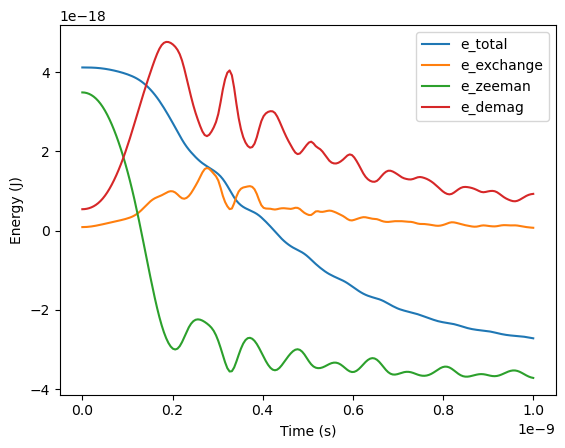

:nosearch:

Micromagnetic standard problem #4
=================================

The problem specification can be found `here <https://www.ctcms.nist.gov/~rdm/mumag.org.html>`_.

.. code-block:: python
    
    from mumaxplus import *
    from mumaxplus.util import show_field

    import matplotlib.pyplot as plt
    import numpy as np

Construct a world containing a single magnet with the dimensions mentioned in the
problem specification.

.. code-block:: python
    
    length, width, thickness = 500e-9, 125e-9, 3e-9
    nx, ny, nz = 128, 32, 1

    world = World(cellsize=(length/nx, width/ny, thickness/nz))

    magnet = Ferromagnet(world, Grid((nx, ny, nz)), name="my_magnet")

    magnet.msat = 800e3
    magnet.aex = 13e-12
    magnet.alpha = 0.02

    show_field(magnet.magnetization)

.. image:: ../images/stdp4_1.png
   :align: center
   :width: 600px

Relax the magnetization to an 'S' state in the x-direction.

.. code-block:: python
    
    magnet.magnetization = (1, 0.1, 0)
    magnet.minimize()

    show_field(magnet.magnetization)

.. image:: ../images/stdp4_2.png
   :align: center
   :width: 600px

Apply one of the two external fields mentioned in the problem specification.

.. code-block:: python
    
    world.bias_magnetic_field = (-24.6e-3, 4.3e-3, 0)
    #world.bias_magnetic_field = (-35.5e-3, -6.3e-3, 0)

Schedule the output by defining a list of timepoints and a table of quantities.

.. code-block:: python
    
    timepoints = np.linspace(0, 1e-9, 200)
    outputquantities = {
        "mx": lambda: magnet.magnetization.average()[0],
        "my": lambda: magnet.magnetization.average()[1],
        "mz": lambda: magnet.magnetization.average()[2],
        "e_total": magnet.total_energy,
        "e_exchange": magnet.exchange_energy,
        "e_zeeman": magnet.zeeman_energy,
        "e_demag": magnet.demag_energy
    }

Run a timesolver to evaluate the table quantities at the given time points.

.. code-block:: python
    
    output = world.timesolver.solve(timepoints, outputquantities)

    show_field(magnet.magnetization)

.. image:: ../images/stdp4_3.png
   :align: center
   :width: 600px

Plot the average magnetization in time.

.. code-block:: python
    
    for key in ["mx", "my", "mz"]:
    plt.plot(timepoints, output[key], label=key)

    plt.xlabel("Time (s)")
    plt.legend()
    plt.show()

.. image:: ../images/stdp4_4.png
   :align: center
   :width: 600px

Plot the average energies.

.. code-block:: python
    
    for key in ["e_total", "e_exchange", "e_zeeman", "e_demag"]:
    plt.plot(timepoints, output[key], label=key)

    plt.xlabel("Time (s)")
    plt.ylabel("Energy (J)")
    plt.legend()
    plt.show()

