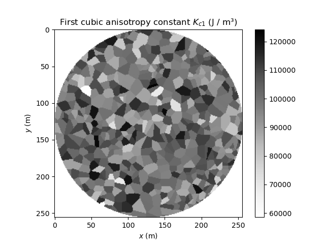

Voronoi
=======

This script shows how to use mumax⁺'s Voronoi Tesselator.
This is inspired by figure 19 of the paper `The design and
verification of MuMax3 <https://doi.org/10.1063/1.4899186>`_.

.. literalinclude:: ../examples/voronoi.py
  :language: python
  :lines: 5-

.. image:: images/voronoi_init.png
   :width: 45%

.. image:: images/voronoi_final.png
   :width: 45%

